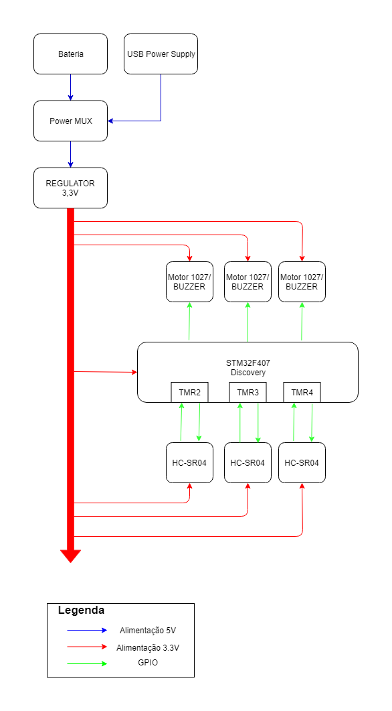
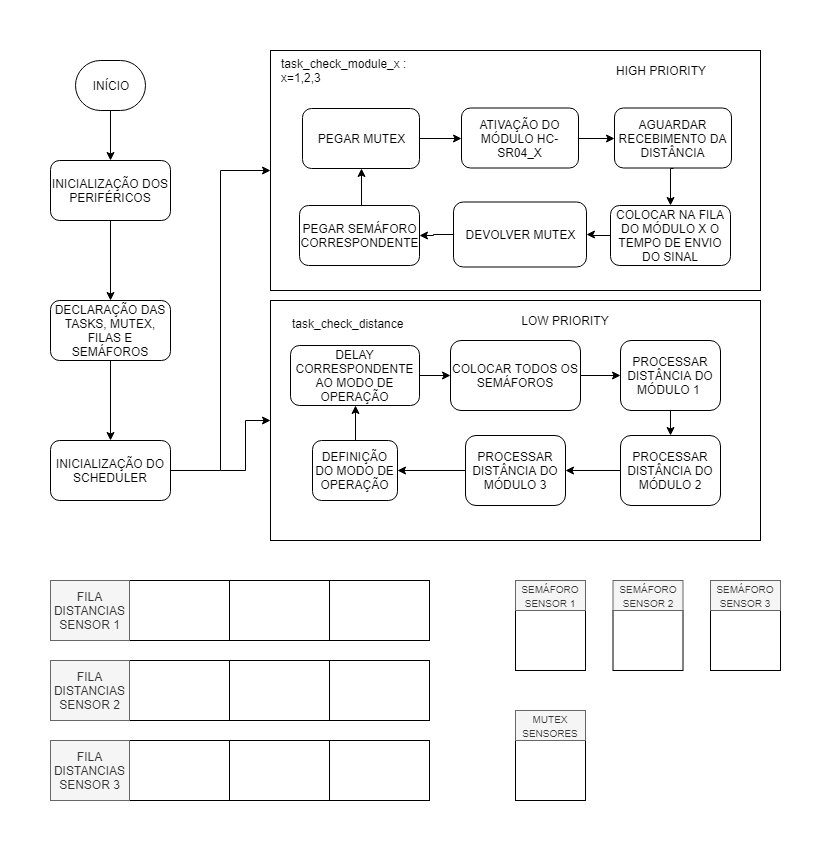

# SENSOR DE PROXIMIDADE
### Conceito e Motivação
O objetivo do projeto é o desenvolvimento de um dispositivo que detecte a distância e informe ao usuário a distância. A fim de simplificação será usado o sensor HC - SR04, e a sensibilidade pode ser ajustada de acordo com a preferência do usuário.

A motivação desse projeto é criar uma alternativa para deficientes visuais que seja com um retorno mais rápido e mais discreto, em relação à bengala usada normalmente

### Diagrama de Blocos
O projeto seguirá como base o seguinte diagrama de blocos

### Fluxograma do programa
O projeto será realizado em FreeRTOS e terá como base o seguinte fluxograma com as tarefas, filas e semáforos como a seguir:

### Pinout do sistema
|PIN STM32F4DISCOVERY| PERIFÉRICO |
|--|--|
|PA6|SENSOR_1_ECHO|
|PB0|SENSOR_1_TRIG|
|PB6|SENSOR_2_ECHO|
|PB8|SENSOR_2_TRIG|
|PA0|SENSOR_3_ECHO|
|PA2|SENSOR_3_TRIG|
|PB3|BUZZER1|
|PB4|BUZZER2|
|PB5|BUZZER3|
